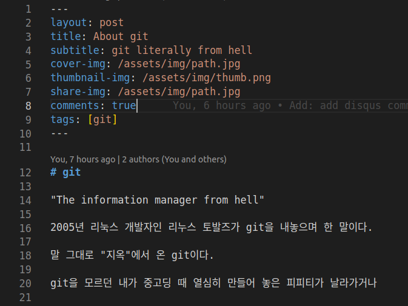
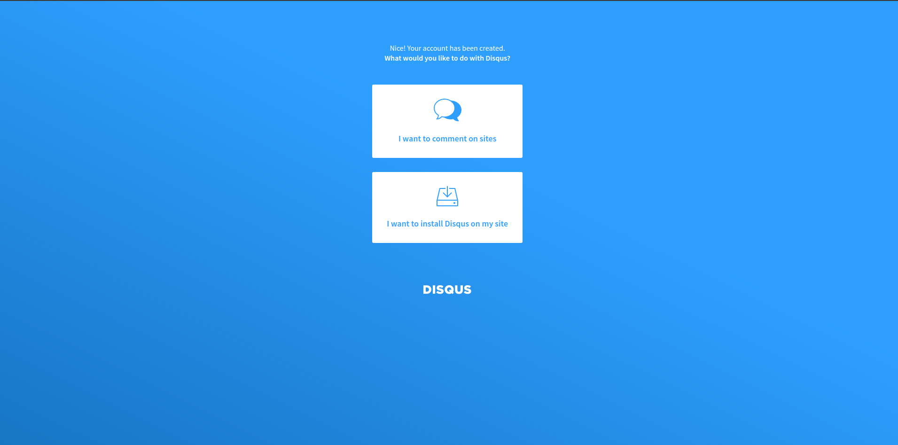
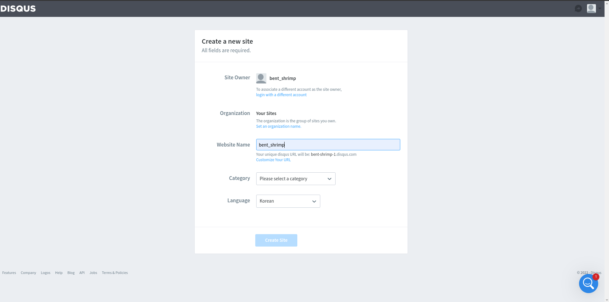
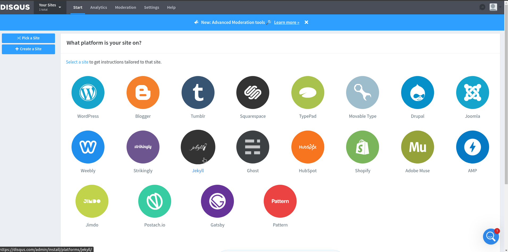
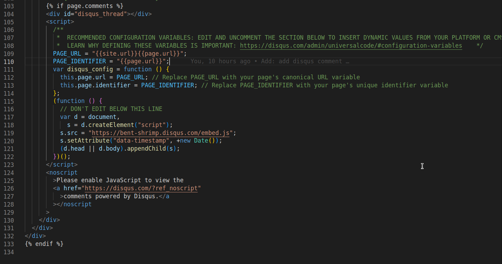

## 제작 과정

### 1. 원하는 테마 원격 저장소를 포크 뜬다.


테마를 먼저 가져오고 내용을 변경하면 개인적인 내용에 테마를 덮어씌울 때 생기는 의존성 문제가 생길 염려가 없다.

저장소 이름은 <username\>.github.io

    git clone <원격 저장소 주소> <저장 경로>

---
### 2. jekyll 시작하기

jekyll 실행

    bundle exec jekyll serve

localhost:4000으로 접속

LoadError 발생 시

    bundle add webtick

---

### 3. 커스터마이징

\_config.yml을 포함한 파일들 내가 원하는대로 수정하기

## git으로 프로젝트 관리하기

수정한 후 변경 사항 add로 stage

    git add <원하는 파일이나 디렉토리>

stage된 상태를 commit

    git commit -m "<커밋 메시지>"

commit한 사항 원격 저장소에 반영하기

    git push

---

### 4. post 작성하기



---

### 5. disqus 댓글 추가

#### 1. disqus 가입

#### 2. I want to install disqus on my website 선택


#### 3. website name 입력


#### 4. platform 중 jekyll 선택


#### 5. \_config.yml 댓글 disqus로 설정
```
comment:
  provider: "disqus"
  disqus: 
    shortname: "super-corini"
```

#### 6. post 레이아웃에 댓글 추가


#### 7. 댓글을 허용하고 싶은 곳에 `comments : true` 추가


---

### 6. jekyll-admin 추가

Gemfile에 다음과 같이 추가

    gem 'jekyll-admin', group: :jekyll_plugins

추가한 플러그인 설치

    bundle install
